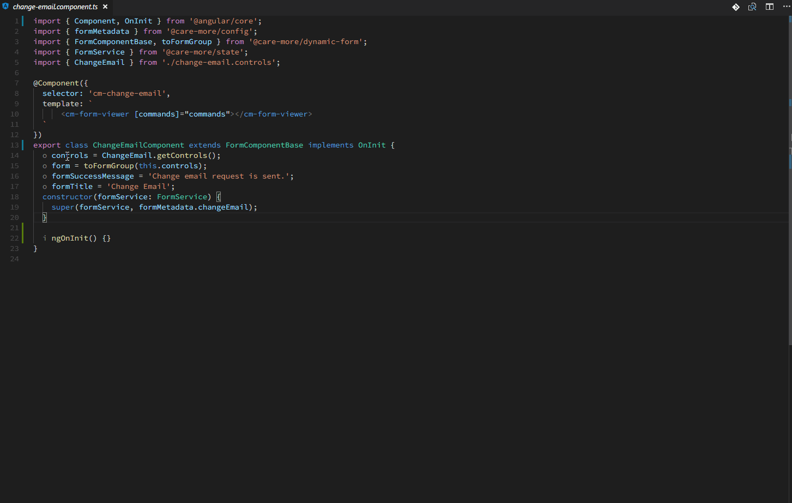
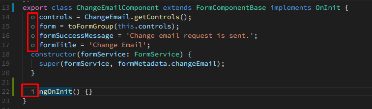

# Class IO

Class IO shows class relationships with its interfaces and parent class in a non-obstructive way. Class IO is an alternative to ClassLens.



Unlike ClassLens, Class IO is not a CodeLens provider and therefore it does not require CodeLens to be enabled.

Class IO analyses document symbols on opening a Typescript/Javascript file and marks the following members in a class:

1.  any class member that is an implementations of the class's interfaces.
2.  any class member that overrides base class's member.



## Code Navigation

There are two ways to quickly navigate to parents:

1.  **Go To Definition**: Class IO also allows you to quickly navigate to the parent member by provide extra definition to above marked members. To navigate to parent members, use Go To Definition and choose the parent member in the peak definition popup.

2.  **Context menu or keyboard shortcut**: Class IO also provide a command and a context menu item to navigate to parent: while cursor is on the child member, right click mouse and choose "Go To Parent", or click the default key binding: Alt+Shift+G

## Configuration

Change the mark up symbols and color with the following configuration:

```
  // The symbol will be attached to before interface implementation members.
  "classio.implementationSymbol": "i ",

  // The color of attached implementation symbol.
  "classio.implementationSymbolColor": "rgba(128,128,128,1)",

  // The symbol will be attached to before override member.
  "classio.overrideSymbol": "o ",

  // The color of attached override symbol.
  "classio.overrideSymbolColor": "rgba(128,128,128,1)"

 // How long the user should idle for before Class IO start updating.
  "classio.timeOut": 500
```

## Performance

Class IO builds up a database alike cache as you develop your project. Therefore it will cost you hardly anything after it has seen all of your class structures.

Caches will be saved to workspace state and each time you open vscode, Class IO will recover the cache from workspace state.

## Cache

To clear workspace cache:

CTRL/CMD + P: then search for "Class IO: Clear Cache".

Note: Reset cache when Class IO is updated and it is not fully working on files opened before.

# Support

Really enjoying Class IO?

[Write a review](https://marketplace.visualstudio.com/items?itemName=rexebin.classio#review-details)

In a giving mood?

[Donate](https://www.paypal.me/rexebin)

Your support is greatly appreciated!

# Links

[Github Repository](https://github.com/rexebin/classio)

[Raise an issue](https://github.com/rexebin/classio/issues)

[Install ClassLens from VSCode Marketplace](https://marketplace.visualstudio.com/items?itemName=rexebin.classio)
